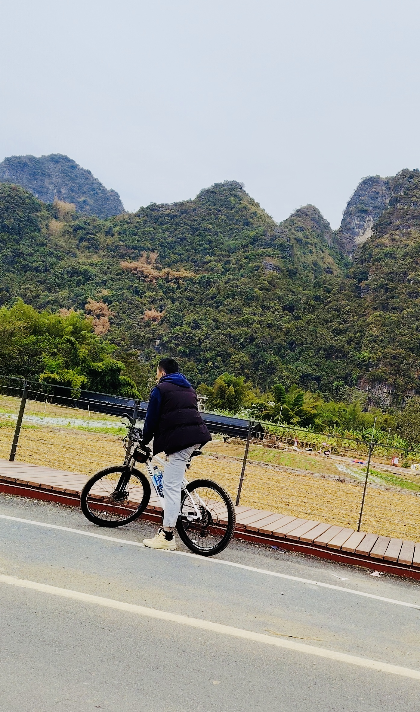

# Introduction
Hi! I'm Huang Bangning, a student in the Framework-Based Software Design and Development course. 
As you can see the image that showed below this page， I like cycling in my free time but 
I expect to learn a lot about modern software maintenance practices and how to work with legacy systems. 
It my pressure to meet you all. Let us work together to explore this subject. 

  <!-- Link to the uploaded image -->

## GitHub Profile

You can view my personalized GitHub profile [here, insert link to your github profile]

